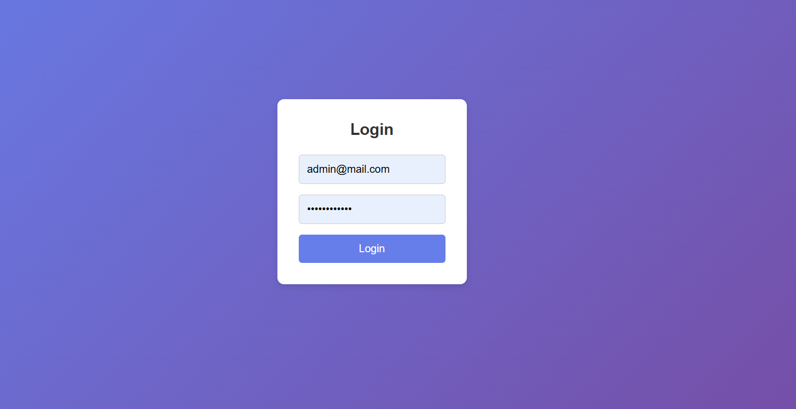

# React Vite Project

## 📌 Description
This project is a frontend "Toko-Mini" application developed using **React** and **Vite**. The application communicates with a backend via an API and retrieves images from available storage.

🚧 *This project is currently under further development.* 🚧

## 📦 Technologies Used
- **React** (Vite as the bundler)
- **Yarn / npm** (for package management)
- **Axios** (for HTTP requests)
- **Tailwind CSS** *(optional, if used)*

## ⚙️ Environment Configuration
Make sure you have a `.env` file in the project root with the following content:

```
VITE_API_URL=http://localhost:8000/api
VITE_IMAGE_API=http://localhost:8000/storage
```

## 🚀 How to Run the Project
### 1. Clone the Repository
```sh
git clone <repository-url>
cd <project-name>
```

### 2. Install Dependencies
If using **Yarn**:
```sh
yarn install
```

If using **npm**:
```sh
npm install
```

### 3. Run the Project
If using **Yarn**:
```sh
yarn dev
```

If using **npm**:
```sh
npm run dev
```

The application will run at `http://localhost:5173/` *(default Vite port)*.

## 🔗 API Endpoints
Ensure the backend is running at `http://localhost:8000/` as per the environment configuration:
- API: `${VITE_API_URL}` → `http://localhost:8000/api`
- Images: `${VITE_IMAGE_API}` → `http://localhost:8000/storage`

## 🛠️ Build for Production
To build the project for production:
```sh
npm run build  # or yarn build
```
The build output will be in the `dist/` folder.

## 🖼️ Screenshots
Here are some screenshots of the project:



 

## 📜 License
This project is licensed under the [MIT](LICENSE) license.

